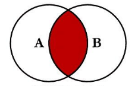
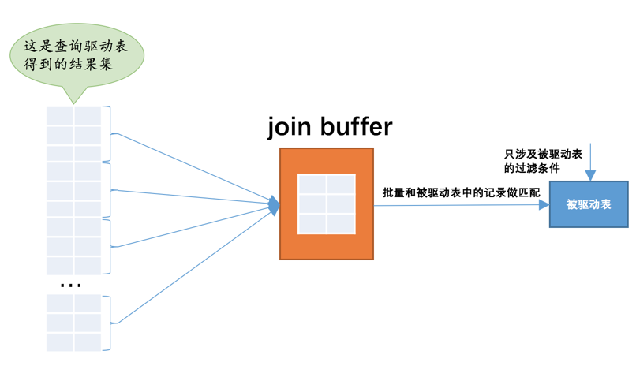

# MySQL 中 join 与 left join 的区别是什么？

## 基本概念

连接分为内连接和外连接，其中外连接又分为左外连接和右外连接。

内连接：INNER JOIN。也可以写 CROSS JOIN 或 JOIN。

左外连接：LEFT [OUTER] JOIN。

右外连接：RIGHT [OUTER] JOIN。

## LEFT JOIN


**“找左表以及交集”。**左表为驱动表。

对于 WHERE 子句的过滤条件，不符合条件的数据都不会加入结果集。

对于 ON 子句中的过滤条件，无法在被驱动表中找到匹配ON子句中的过滤条件的记录仍会加入结果集，对应被驱动表记录的各个字段使用 NULL 填充。


## JOIN



**“找交集”**。驱动表中的记录在被驱动表中找不到匹配的记录，该记录不会加入到最后的结果集。

对于 WHERE 和 ON 过滤条件都是等价的，不符合条件的记录都不会加入结果集。


## JOIN 原理

### 嵌套循环连接（Nested-Loop Join）

对于两表连接来说，驱动表只会被访问一遍，但被驱动表却要被访问到好多遍。

- 步骤1：选取驱动表，使用与驱动表相关的过滤条件，选取代价最低的单表访问方法来执行对驱动表的单表查询。
- 步骤2：对上一步骤中查询驱动表得到的结果集中每一条记录，都分别到被驱动表中查找匹配的记录。


如果有3个表进行连接的话，那么`步骤2`中得到的结果集就像是新的驱动表，然后第三个表就成为了被驱动表，重复上边过程，也就是`步骤2`中得到的结果集中的每一条记录都需要到`t3`表中找一找有没有匹配的记录，用伪代码表示一下这个过程就是这样：

```
for each row in t1 {   #此处表示遍历满足对t1单表查询结果集中的每一条记录
    
    for each row in t2 {   #此处表示对于某条t1表的记录来说，遍历满足对t2单表查询结果集中的每一条记录
    
        for each row in t3 {   #此处表示对于某条t1和t2表的记录组合来说，对t3表进行单表查询
            if row satisfies join conditions, send to client
        }
    }
}
```

这个过程就像是一个嵌套的循环，所以这种驱动表只访问一次，但被驱动表却可能被多次访问，访问次数取决于对驱动表执行单表查询后的结果集中的记录条数的连接执行方式称之为`嵌套循环连接`（`Nested-Loop Join`），这是最简单，也是最笨拙的一种连接查询算法。

### 使用索引加快连接速度

在没有索引的情况下，被驱动表被访问时默认是全表扫描。如果被驱动表有索引，并且被访问时根据索引进行查找，可以大大减少回表次数，性能会高很多。

### 基于块的嵌套循环连接（Block Nested-Loop Join）

采用`嵌套循环连接`算法的两表连接过程中，被驱动表要被访问多次，如果这个被驱动表数据特别多而且不能使用索引访问，就相当于要从磁盘上读好几次这个表，`I/O`代价非常大，所以要**尽量减少访问被驱动表的次数**。

`join buffer`是执行连接查询前申请的一块固定大小的内存，先把若干条驱动表结果集中的记录装在这个`join buffer`中，然后开始扫描被驱动表，每一条被驱动表的记录一次性和`join buffer`中的多条驱动表记录做匹配，因为匹配的过程都是在内存中完成的，所以可以显著减少被驱动表的`I/O`代价。这就是基于块的嵌套循环连接。




`join buffer`的大小通过启动参数或者系统变量`join_buffer_size`配置，默认大小为`262144字节`（也就是`256KB`），最小可以设置为`128字节。`

驱动表不是所有列都会被放到`join buffer`中，只有查询列表中的列和过滤条件中的列才会被放到`join buffer`中，所以再次提醒我们，最好不要把`*`作为查询列表，只需要把我们关心的列放到查询列表就好了，这样还可以在`join buffer`中放置更多的记录。

## 总结图

